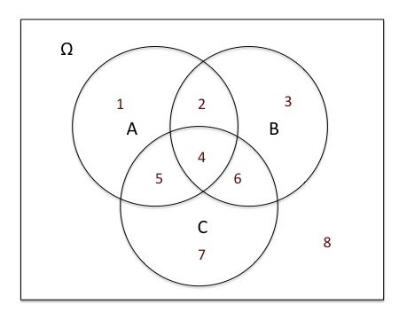

# Elements of a Probabilistic Model

- The **sample space Ω**, which is the set of all possible outcomes of an
  experiment.
- The **probability law**, which assigns to a set A of possible outcomes (also called an event) a nonnegative number **P(A)** (called the **probability of A**) that encodes our knowledge or belief about the collective “likelihood” of the elements of A. The probability law must satisfy certain properties to be introduced shortly.

# Probability Axioms

1. (**Nonnegativity**) P(A) ≥ 0, for every event A.
2. (**Additivity**) If A and B are two disjoint events, then the probability of their union satisfies
   
   $P(A ∪ B) = {P(A) + P(B)}$
   
   More generally, if the sample space has an infinite number of elements and A1 , A2 , . . . is a sequence of disjoint events, then the probability of their union satisfies

   $P(A1 ∪A2 ∪···) = {P(A1)+P(A2)+···}.$

3. (**Normalization**) The probability of the entire sample space Ω is equal to 1, that is, 
   
   $P(Ω) = 1.$

# Discrete Probability Law

If the sample space consists of a finite number of possible outcomes, then the probability law is specified by the probabilities of the events that consist of a single element. In particular, the probability of any event {s1, s2, . . . , sn} is the sum of the probabilities of its elements:

  $P({s1, s2, . . . , sn}) = {P(s1) + P(s2) + · · · + P(sn)}.$

# Discrete Uniform Probability Law

If the sample space consists of n possible outcomes which are equally likely (i.e., all single-element events have the same probability), then the proba- bility of any event A is given by

  $P(A) = {number\ of\ elements\ of\ A \over n}$

# Some Properties of Probability Laws

Consider a probability law, and let A, B, and C be events.

- (a) $IfA⊂B,thenP(A)≤P(B).$
- (b) $P(A∪B)=P(A)+P(B)−P(A∩B).$
- (c) $P(A∪B)≤P(A)+P(B).$
- (d) $P(A∪B∪C)=P(A)+P(Ac ∩B)+P(Ac ∩Bc ∩C).$

# Venn disgrams

### At least two of the events A, B, C occur.

- Regions: 2 4 5 6
- $(A \cap B) \cup (A \cap C) \cup (B \cap C)$

### At most two of the events A, B, C occur.

- Regions: 1 2 3 5 6 7 8
- $(A \cap B \cap C)^c$

### None of the events A, B, C occurs.

- Region: 8
- $A^c \cap B^c \cap C^c$

### All three events A, B, C occur:

- Region: 4
- $A \cup B \cup C$

### Exactly one of the events A, B, C occurs.

- Regions: 1 3 7
- $(A \cap B^c \cap C^c) \cup (A^c \cap B \cap C^c) \cup (A^c \cap B^c \cap C)$

### Events A and B occur, but C does not occur.

- Region: 2
- $ A \cap B \cap C^c $

### Either (i) event occurs, or (ii) neither or occurs.

- Regions: 1 2 3 4 6 8
- $B \cup (B^c \cap C^c)$

# Conditional Probabilites
$P(A|B) =$ "probability of A given that B occured"

$P(A|B) = {P(A \cap B) \over P(B)}$

Exercise
1. If Ω is finite and we have a discrete uniform probability law, and if $B \neq 0$, then the conditional probability law on B given that B occurred, is also discrete uniform.
        
   - **True**, because the outcomes inside B  maintain the same relative proportions as in the original probability law.

2. If Ω is finite and we have a discrete uniform probability law, and if $B \neq 0$, then the conditional probability law on Ω, given that B occurred, is also discrete uniform.
        
   - **False**. Outcomes in Ω that are outside B have zero conditional probability, so it cannot be the case that all outcomes in Ω have the same conditional probability.
4. [die roll example](https://learning.edx.org/course/course-v1:MITx+6.431x+2T2023/block-v1:MITx+6.431x+2T2023+type@sequential+block@Lec__2_Conditioning_and_Bayes_rule/block-v1:MITx+6.431x+2T2023+type@vertical+block@ch4-s2-tab4)
5. $IF A \cap C = \phi, then P(A \cup C | B) = P(A | B) + P(C | B)$

### 7. A radar example: models based on conditional probabilities and three basic tools

### The Multiplication Rule

$P(A|B) = {P(A \cap B) \over P(B)}$

#### The probability that two events occur is equal to the probability that a first event occurs, event B in this case, times the conditional probability that the second event, event A, occurs, given that event B has occurred.
We are free to choose which one (A or B) as the first event.

$P(A \cap B) = P(B)P(A|B) = P(A)P(B|A)$

In other words, we can calculate the probability of a leaf by just multiplying the probabilities of the different branches involved and where we use conditional probabilities for the intermediate branches.

$P(A \cap B \cap C) = P(A)P(A|B)P(A|A \cap B)$

#### Total probability theorem
In words, the probability that an event occurs is a weighted average of the probability that it has under each possible scenario, where the weights are the probabilities of the different scenarios.

### Bayes' Rule

### 13. Exercise: Bayes' rule and the false-positive puzzle
A test for a certain rare disease is assumed to be correct  of the time: if a person has the disease, the test result is positive with probability , and if the person does not have the disease, the test result is negative with probability . A person drawn at random from a certain population has probability  of having the disease.
1. Find the probability that a random person tests positive. 
2. Given that the person just tested positive, what is the probability he actually has the disease?
Let A be the event that the person has the desease, and B the event that the test result is positive.
- The probability taht a random person tests positive is
  
  $P(B) = P(A)(P(B|A) + P(A^c)P(B|A^c) = 0.001 * 0.95 + 0.999 * 0.05 = 0.0509$
  
- Given that the person just tested positive, what is the probability he actually has the disease

  $P(A|B) = {P(A)P(B|A) \over P(B)} = {0.001 * 0..95 \over 0.0509} = 0.01866$

# Independence
But if the conditional probability turns out to be the same as the unconditional probability, then the occurrence of event A does not carry any useful information on whether event B will occur. **In such a case, we say that events A and B are independent.**

### 2. A coin tossing example
- Each particular branch corresponds to a sequence of possible results in the different stages, 
- and the leaves of this tree correspond to the possible outcomes.

**The intuitive meaning of Independence**: 
- Intuitive "defination": $P(B|A) = P(B)$
        - The occurrence of A provides no new information about B.
        - In such case, we may say taht event B is independent from event A.
- Formal Definition of Independence: $P(A \cap B) = P(A)P(B)$
        - The formal definition is symmetric with respect to the roles of A and B. So instead of saying that B is independent from A, we can also say A is independent from B.
        - A and B are independent of each other.
        - Namely, that the conditional probability of A given B is the same as the unconditional probability of A.
        - In contrast, this new definition makes sense even when we're dealing with zero probability events.
#### Disjoint vs Independence

- two events, A and B, both of which have positive probability.
- two events are disjoint.
- They do not have any common elements. **Are these two events independent?**
- The probability that both A and B occur is zero because the two events are disjoint. They cannot happen together.
- The following two expressions are different from each other
  - $P(A \cap B) = 0$
  - $P(A)P(B) > 0$
  - **Conclusion: two events are not independent**
- In fact, intuitively, these two events are as dependent as Siamese twins. If you know that A occurred, then you are sure that B did not occur.
- So the occurrence of A tells you a lot about the occurrence or non-occurrence of B.
**Being independent is somthing completely different from being disjoint.**
- Independence is a relation about information. It is important to always keep in mind the intuitive meaning of independence.
  - **Two events are independent if the occurrence of one event does not change our beliefs about the other.**
  - **It does not affect the probability that the other event also occurs.**
- When do we have independence in the real world?
        - The typical case is when the occurrence or non-occurrence of each of the two events A and B is determined by two physically distinct and non-interacting processes.
        - For example, whether my coin results in heads and whether it will be snowing on New Year's Day are two events that should be modeled as independent.
#### 4. Exercise: Independence of two events - I
 
- We have a peculiar coin. When tossed twice, the first toss results in Heads with probability . However, the second toss always yields the same result as the first toss. Thus, the only possible outcomes for a sequence of 2 tosses are  and , and both have equal probabilities. Are the two events $A = {Heads in the first toss}$  and $B = \{Heads in the second toss\}$ independent?
- Solution:
  - Intuitively, the occurrence of event  gives us information on whether event  will occur, and therefore the two events are dependent.
  - Mathematically, $P(A) = P(B) = P(A \cap B) = {1 \over 2}$, so taht $P(A \cap B) \neq P(A)P(B)$

#### 5. Exercise: Independence of two events - II
- Let A  be an event, a subset of the sample space $\Omega$ . Are A and $\Omega$ independent?
- Solution:
  - Yes, they are independent. Because $P(A \cap \Omega) = P(A) = P(A) * 1 = P(A) * P(\Omega)$
  - Intuitively,  $P(A)$ represents our beliefs about the likelihood that A will occur. If we are told that $\Omega$ occurred, this does not give us any new information; we already knew that $\Omega$ is certain to occur. For this reason, $P(A | \Omega) = P(A)$.

#### 6. Exercise: Independence of two events - III
- When is an event  independent of itself?
- Solution:
  - If and only if $P(A)$ is either 0 of 1
 
 

#### if A and B are independent, then A and $B^c$ are also indepedent.

**$A$ and $B$ independent => $A$ and $B^c$ independent => $B^c$ and $A$ independent => $B^c$ and $A^c$ independent => $A^c$ and $B^c$ independent**

### 9. Conditional independence
- Definaiton of conditional independence
  - $P(A \cap B | C) = P(A|C)P(B|C)$
  

#### Is there a relation between independence and conditional independence? Does one imply the other?

- in the new universe where C has happened, events A and B have no intersection.
- this means that events A and B are extremely dependent.
  - Within C, if A occurs, this tells us that B did not occur.
- **The conclusion from this example is that independence does not imply conditional independence.**
  - **Given C A and B are not independent.**

  - If and only if $P(A)$ is either 0 of 1

#### Exercise: Conditional independence
Suppose that  and  are conditionally independent given . Suppose that $P(C) > 0$ and $P(C^c) > 0$.
- Are $A$ and $B^c$  guaranteed to be conditionally independent given $C$?
  - YES
  - We have seen that in any probability model, independence of  and  implies independence of  and . The conditional model (given ) is just another probability model, so this property remains true.
- Are $A$ and $B$ guaranteed to be conditionally independent given $C^c$?
  - NO
  - This may be true in some special cases, e.g., if  and  both have zero probability.
  - However, it is in general false.
  - Suppose, for example, that events  and  have nonempty intersection inside , and are conditionally independent, but have empty intersection inside , which would make them dependent (given ).
#### 12. Independence of a collection of events
Let us start with intuition. We will say that a family of events are independent if knowledge about some of the events doesn't change my beliefs, my probability model, for the remaining events.
**We will say that a collection of events are independent if you can calculate probabilities of intersections of these events by multiplying individual probabilities. And this should be possible for all choices of indices involved and for any number or events involved.**

####  pairwise independence.

#### 13. Exercise: Independence of multiple events
Suppose that A, B, C, and D are independent. Use intuitive reasoning (not a mathematical proof) to answer the following.
- Is it guaranteed that $A \cap C$  is independent from $B^c \cap D$?
  - YES
  - The occurrence of event  contains information about  and , but provides no information on the occurrence of , , or for that matter, . Hence we have independence.
- Is it guaranteed that $A \cap B^c \cap D$ is independent from $B^c \cup D^c$?
  - NO
  - Event D  influences both of the events $A \cap B^c \cap D$ and $B^c \cup D^c$, and therefore introduces a dependence between them. 
  - For a more concrete argument, if we are told that event $A \cap B^c \cap D$  occurs, then we know that $D$  occurred. Therefore,  $D^c$ did not occur, and this generally reduces the probability of event $B^c \cup D^c$ .

#### 14. Independence versus pairwise independence
So in this example, H1, H2, and C are pairwise independent, but they're not independent in the sense of an independent collection of events.
H1 by itself does not carry any useful information. But the two events together, H1 and H2, do carry useful information about C.
So H1 and H2 carry information relevant to C. And therefore, C is not independent from these two events collectively. And we say that events H1. H2, and C are not independent.

## 15. Reliability
- The analysis of reliability of a system that consists of independent units.

#### 16. Exercise: Reliability
Suppose that each unit of a system is up with probability $2 \over 3$ and down with probability $1 \over 3$. Different units are independent. For each one of the systems shown below, calculate the probability that the whole system is up (that is, that there exists a path from the left end to the right end, consisting entirely of units that are up).
1. What is the probability that the following system is up?

2. What is the probability that the following system is up?

#### Discrete uniform law
- The discrete uniform law says that when your sample space is discrete, and when the outcomes in your sample space are equally likely, then to compute the probability of any
event A, you can simply count the number of outcomes in A and divide it by the total number of possible outcomes.

#### 1. Conditional probability example
Conditional probability example. We roll two fair 6-sided dice. Each one of the 36 possible outcomes is assumed to be equally likely.

(a) Find the probability that doubles are rolled (i.e., both dice have the same number).

(b) Given that the roll results in a sum of 4 or less, find the conditional probability that doubles are rolled.

(c) Find the probability that at least one die roll is a 6.

(d) Given that the two dice land on different numbers, find the conditional probability that at least one die roll is a 6.

**Conditioning means you're now restricting your attention to a conditional universe.**
**So essentially, we're going to find the number of outcomes in the conditional world. And then we're also going to compute the number of outcomes that comprise S in the conditional world.**
**In conditional world, when you condition, the relative likelihoods of the various outcomes don't change. So in our original universe, all of the outcomes were equally likely. So in our conditional universe, all of the outcomes are equally likely.**

#### 2. A chess tournament problem

2. A chess tournament problem

[video](https://learning.edx.org/course/course-v1:MITx+6.431x+2T2023/block-v1:MITx+6.431x+2T2023+type@sequential+block@sequential_Solved_problems/block-v1:MITx+6.431x+2T2023+type@vertical+block@ch4-s4-tab2)

A chess tournament problem. This year's Belmont chess champion is to be selected by the following procedure. Bo and Ci, the leading challengers, first play a two-game match. If one of them wins both games, he gets to play a two-game second round with Al, the current champion. Al retains his championship unless a second round is required and the challenger beats Al in both games. If Al wins the initial game of the second round, no more games are played.

Furthermore, we know the following:
 The probability that Bo will beat Ci in any particular game is 0.6.
 The probability that Al will beat Bo in any particular game is 0.5.
 The probability that Al will beat Ci in any particular game is 0.7.

Assume no tie games are possible and all games are independent.

1. Determine the a priori probabilities that
(a) the second round will be required.
(b) Bo will win the first round.
(c) Al will retain his championship this year.

2. Given that the second round is required, determine the conditional probabilities that
(a) Bo is the surviving challenger.
(b) Al retains his championship.

3. Given that the second round was required and that it comprised only one game, what is the conditional probability that it was Bo who won the first round?

#### 3. A coin tossing puzzle
A coin tossing puzzle. A coin is tossed twice. Alice claims that the event of getting two Heads is at least as likely if we know that the first toss is Heads than if we know that at least one of the tosses is Heads. Is she right? Does it make a difference if the coin is fair or unfair? How can we generalize Alice's reasoning?

#### 4. The Monty Hall problem
The Monty Hall problem. This is a much discussed puzzle, based on an old American game show. You are told that a prize is equally likely to be found behind any one of three closed doors in front of you. You point to one of the doors. A friend opens for you one of the remaining two doors, after making sure that the prize is not behind it. At this point, you can stick to your initial choice, or switch to the other unopened door. You win the prize if it lies behind your final choice of a door. Consider the following strategies:

Stick to your initial choice.

Switch to the other unopened door.

You first point to door 1. If door 2 is opened, you do not switch. If door 3 is opened, you switch.

Which is the best strategy?

#### 5. A random walker
A random walker. Imagine a drunk tightrope walker, who manages to keep his balance, but takes a step forward with probability  and takes a step back with probability .

(a) What is the probability that after two steps, the tightrope walker will be at the same place on the rope as where he started?

(b) What is the probability that after three steps, the tightrope walker will be one step forward from where he started?

(c) Given that after three steps he has managed to move ahead one step, what is the probability that the first step he took was a step forward?

#### 6. Communication over a noisy channel
Communication over a noisy channel. A source transmits a message (a string of symbols) over a noisy communication channel. Each symbol is  or  with probability  and , respectively, and is received incorrectly with probability  and , respectively (see the figure below). Errors in different symbol transmissions are independent.

(a) What is the probability that the th symbol is received correctly?

(b) What is the probability that the string of symbols  is received correctly?、
- Each bit is independent

(c) In an effort to improve reliability, each symbol is transmitted three times and the received string is decoded by majority rule. In other words, a  (or ) is transmitted as  (or , respectively), and it is decoded at the receiver as a  (or ) if and only if the received three-symbol string contains at least two 's (or 's, respectively). What is the probability that a  is correctly decoded?

(d) For what values of  is there an improvement in the probability of correct decoding of a  when the scheme of part (c) is used?

(e) Suppose that the scheme of part (c) is used. What is the probability that a symbol was 0 given that the received string is 101?
- Application of Bayes Rule

#### 7. Network reliability
Network reliability. An electrical system consists of identical components, each of which is operational with probability , independent of other components. The components are connected in three subsystems, as shown in the figure. The system is operational if there is a path that starts at point , ends at point , and consists of operational components. What is the probability of this happening?

